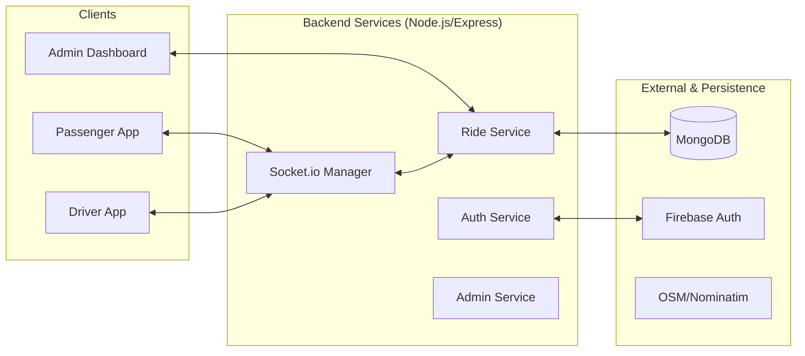

# High-Level Design (HLD)
## Project: Campus E-Rickshaw System

---

## 1. System Architecture

The system follows a **Modular Monolith** architecture for the backend with separate **React-based Micro-frontends** for each user role. Real-time capabilities are provided via a dedicated Socket.io layer.

### 1.1 Architecture Diagram


---

## 2. Technology Stack

| Layer | Technology | Rationale |
| :--- | :--- | :--- |
| **Frontend** | React (Vite) | Fast development, component-based, high performance. |
| **Mobile** | Expo (React Native) | Cross-platform compatibility for Driver app. |
| **Backend** | Node.js (Express) | Asynchronous I/O, ideal for real-time applications. |
| **Database** | MongoDB | Flexible schema for ride objects and geo-spatial queries. |
| **Real-time** | Socket.io | Bi-directional communication for location and status updates. |
| **Auth** | Firebase Auth | Secure, production-ready identity management. |
| **Maps** | Leaflet / OSM | Open-source, no usage costs for campus-scale deployment. |

---

## 3. Core Components

### 3.1 Backend Components
- **API Gateway (Express):** Handles routing, middleware (CORS, JSON parsing), and authentication checks.
- **Socket Manager:** Centralizes socket logic, room management, and event broadcasting.
- **Geospatial Engine:** Uses MongoDB's `$near` and `$geoWithin` operators to find drivers within a 2km radius of a pickup point.

### 3.2 Frontend Modules
- **Map Module:** An abstraction layer over Leaflet to handle markers, polylines (ride paths), and user location.
- **Socket Context:** A React Context provider that wraps the app to provide a consistent socket connection.

---

## 4. Key Data Flows

### 4.1 Ride Request & Matching Flow
1.  **Passenger** sends a `POST /api/rides/request`.
2.  **Backend** saves the ride as `PENDING` and returns the `rideId`.
3.  **Passenger** emits `REQUEST_RIDE` via socket.
4.  **Backend** queries MongoDB for online drivers within 2km.
5.  **Backend** emits `NEW_RIDE_REQUEST` to the filtered list of drivers.
6.  **Driver** accepts; Backend updates status to `ACCEPTED` and notifies the Passenger.

### 4.2 Real-time Tracking Flow
1.  **Driver** emits `LOCATION_UPDATE` every 5-10 seconds.
2.  **Backend** updates the Driver's coordinates in the database.
3.  **Backend** broadcasts the update to the Passenger in the specific `ride_room`.

---

## 5. Database Schema (High-Level)

### 5.1 User Collection
```json
{
  "uid": "Firebase UID",
  "name": "String",
  "role": "PASSENGER | DRIVER | ADMIN",
  "status": "APPROVED | PENDING" (Drivers only)
}
```

### 5.2 Ride Collection
```json
{
  "passengerId": "ObjectId",
  "driverId": "ObjectId (Optional)",
  "status": "IDLE | REQUESTING | ACCEPTED | ARRIVED | ONGOING | COMPLETED | CANCELLED",
  "pickup": { "type": "Point", "coordinates": [lng, lat] },
  "destination": { "type": "Point", "coordinates": [lng, lat] },
  "rating": "Number",
  "feedback": "String"
}
```

---

## 6. Security Architecture
- **Token Verification:** Every request to the backend must include a `Bearer` token (Firebase ID Token).
- **Socket Auth:** Sockets are authenticated during the connection handshake.
- **Data Isolation:** Queries are scoped to the user's `uid` to prevent unauthorized access to other users' ride histories.

---

## 7. Performance & Scalability
- **Indexing:** Geospatial indexes on `pickup` and `driverLocation` fields for fast matching.
- **Caching:** Driver online status can be cached in-memory (or Redis) to reduce DB load for frequent broadcasts.
- **Stateless API:** The backend is stateless, allowing for horizontal scaling behind a load balancer (using Socket.io Redis adapter if scaled).
