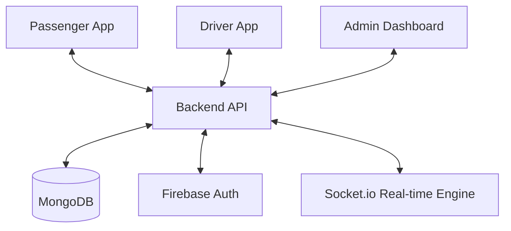

# Software Requirements Specification (SRS)
## Project: Campus E-Rickshaw System

---

## 1. Introduction

### 1.1 Purpose
The purpose of this document is to provide a detailed description of the software requirements for the **Campus E-Rickshaw System**. This system aims to provide a seamless, real-time ride-booking platform for students and staff within a university campus, optimizing the use of electric rickshaws.

### 1.2 Scope
The system consists of four primary modules:
1.  **Passenger Web App**: For users to request rides and track drivers.
2.  **Driver Web App**: For rickshaw drivers to manage ride requests and update their status.
3.  **Admin Dashboard**: For university administrators to manage drivers, view analytics, and monitor campus-wide operations.
4.  **Backend Services**: A central API and real-time engine handling authentication, data persistence, and communication.

### 1.3 Definitions, Acronyms, and Abbreviations
- **SRS**: Software Requirements Specification
- **API**: Application Programming Interface
- **Socket.io**: A library for real-time, bi-directional communication between web clients and servers.
- **Firebase Auth**: Authentication service by Google used for identity management.
- **2km Radius**: The predefined distance threshold for broadcasting ride requests to nearby drivers.

---

## 2. Overall Description

### 2.1 Product Perspective
The Campus E-Rickshaw System is a standalone ecosystem designed to replace manual hailing of rickshaws on campus. It interacts with external services like Firebase for authentication and OpenStreetMap (via Nominatim) for location searching.

### 2.2 Product Functions
- User Authentication (Passenger/Driver/Admin)
- Real-time Location Tracking
- Geofenced Ride Request Broadcasting (2km radius)
- Ride Status Management (Requested, Accepted, Arrived, Ongoing, Completed, Cancelled)
- Driver Approval Workflow
- Operational Analytics and Reporting

### 2.3 User Classes and Characteristics
- **Passengers**: University students/staff. Require ease of use and quick matching.
- **Drivers**: E-Rickshaw operators. Require simple interfaces and real-time alerts.
- **Administrators**: Campus management staff. Require data-driven insights and control over fleet personnel.

### 2.4 Operating Environment
- **Frontend**: Modern web browsers (Chrome, Firefox, Safari, Edge).
- **Mobile (Driver)**: Android/iOS via Expo/React Native.
- **Backend**: Node.js environment with MongoDB database.

---

## 3. External Interface Requirements

### 3.1 User Interfaces
- **Passenger**: Map-centric UI with search bar, ride status cards, and profile/history views.
- **Driver**: High-contrast UI with a prominent "Online/Offline" toggle and full-screen ride notifications.
- **Admin**: Sidebar-based navigation with data tables, interactive maps, and chart visualizations.

### 3.2 Software Interfaces
- **Database**: MongoDB (Atlas or local instance).
- **Auth**: Firebase Admin SDK and Firebase Client SDK.
- **Maps**: Leaflet/OpenStreetMap.
- **Deployment**: Compatible with platforms like Vercel (Frontend) and Render/Railway (Backend).

---

## 4. System Features

### 4.1 Passenger Module
- **Req-1: Booking**: Users shall be able to select pickup and drop-off points via a map or search bar.
- **Req-2: Tracking**: Users shall see the real-time location of the assigned driver.
- **Req-3: Rating**: Users shall be able to rate the driver after the completion of a ride.

### 4.2 Driver Module
- **Req-4: Availability**: Drivers shall be able to toggle their status between "Online" and "Offline".
- **Req-5: Acceptance**: Drivers shall receive notifications for nearby (2km) ride requests and can accept or decline them.
- **Req-6: Ride Execution**: Drivers shall update the ride status to "Arrived", "Start Ride", and "Complete Ride".

### 4.3 Admin Module
- **Req-7: Driver Management**: Admins shall review and approve/reject driver registrations.
- **Req-8: Live Monitoring**: Admins shall see all active rides and online drivers on a campus map.
- **Req-9: Analytics**: Admins shall view metrics like total rides, peak hours, and driver performance.

---

## 5. Non-Functional Requirements

### 5.1 Performance
- **Latency**: Socket events should propagate within 500ms under normal network conditions.
- **Concurrency**: The system shall support at least 100 concurrent ride requests without degradation.

### 5.2 Security
- **Authentication**: All API requests except login/signup must be authenticated via Firebase ID tokens.
- **Authorization**: Role-based access control (RBAC) must ensure passengers cannot access admin routes.

### 5.3 Reliability
- **Persistence**: Ride data and user profiles must be persisted in MongoDB with 99.9% availability.
- **State Recovery**: If a client disconnects, the system shall restore the active ride state upon reconnection.

### 5.4 Maintainability
- The codebase shall follow a clean architecture (Controllers, Routes, Models, Sockets).
- Documentation shall be maintained for all API endpoints and deployment steps.

---

## 6. System Architecture Diagram (Conceptual)

